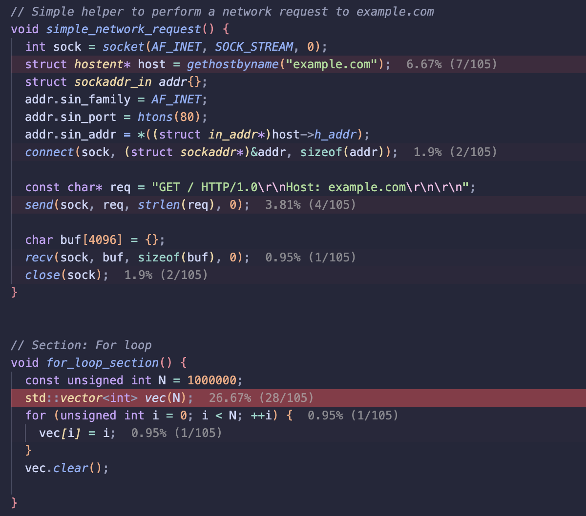
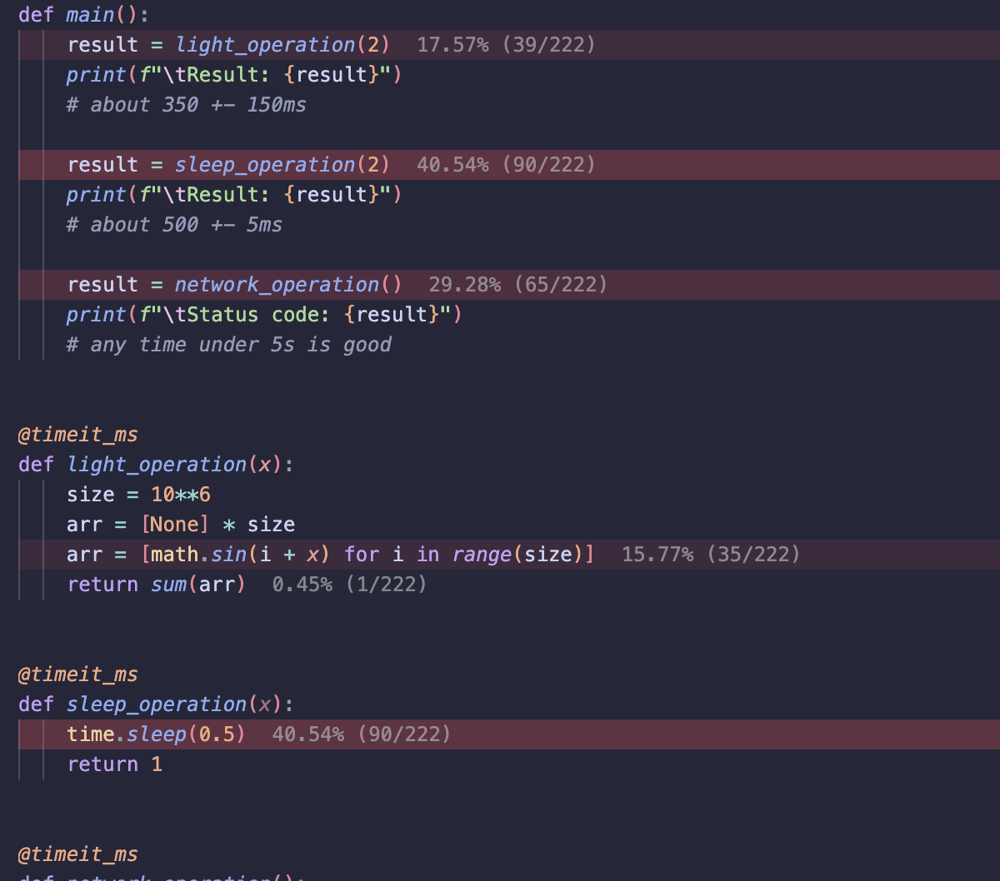

# perfanno-vscode

[](https://marketplace.visualstudio.com/items?itemName=alexd.perfanno)
[](https://marketplace.visualstudio.com/items?itemName=alexd.perfanno)
[](https://github.com/alexdalat/perfanno-vscode/actions/workflows/test.yml)
[](https://github.com/alexdalat/perfanno-vscode/blob/main/LICENSE)

Perfanno-vscode allows users to annotate buffers using [perf](https://perfwiki.github.io/main/) or [py-spy](https://github.com/benfred/py-spy) output information. The result is a beautiful heatmap showing developers where performance bottlenecks are slowing down their program.

<table>
  <tr>
    <th align="center">C++ with <code>perf</code></th>
    <th align="center">Python with <code>py-spy</code></th>
  </tr>
  <tr>
    <td width="50%"></td>
    <td width="50%"></td>
  </tr>
</table>

<!--py-spy example from https://github.com/MalTeeez/python-perfanno-example-->

---

## Workflow

1. Generate profiling information:

```bash
perf record --call-graph dwarf ./my_program --some-arg < some_input_etc
```

*Customization*:
 * `-e` flag can be used to specify the event to profile. By default, it records cpu-cycles.
 * `-F` flag can be used to specify the frequency of the event. For example, `-F 1000` will sample every 1000 events.
 * And many more options. See [this page](https://manpages.ubuntu.com/manpages/bionic/man1/perf-record.1.html) for more information.

<br>

2. Generate a report:

```bash
perf report -g folded,0,caller,srcline,branch,count --no-children --full-source-path --stdio -i perf.data > perf.out
```

<details>
<summary><b>Remote development (optional)</b></summary>
 If you are doing remote development and want to see the heatmap on your local machine, you can use `scp` to copy the `perf.out` file to your local machine. Then, run `sed -i '' "s:{REMOTE_DIRECTORY}:{LOCAL_DIRECTORY}:g" "perf.out"` to replace any instances of the remote directory with the local directory in the perf report.
</details>

<br>

3. Open a source file in vscode and run the `perfanno.readFile` (`Perfanno: Read File`) command using the command palette. Select the `perf.out` file generated in the previous step. Success!

<br>

<details>
<summary><b>Optional: shell aliases</b></summary>

<br>

Add these to your `.bashrc` or `.zshrc`:

```bash
alias perf_record="perf record --call-graph dwarf"
alias perf_report="perf report -g folded,0,caller,srcline,branch,count --no-children --full-source-path --stdio -i perf.data > perf.out"
```

Then step 1 becomes:

```bash
perf_record ./my_program --some-arg < some_input_etc
```

and step 2 becomes:

```bash
perf_report
```

The report command is always the same, so both steps can be chained:

```bash
perf_record ./my_program --some-arg < some_input_etc && perf_report
```

</details>

---

## Py-Spy Workflow

Perfanno also supports [py-spy](https://github.com/benfred/py-spy) raw output for profiling Python programs. See [an example script](https://github.com/MalTeeez/python-perfanno-example/blob/main/tools/pyspy.sh).

1. Profile your Python program with py-spy using the `raw` format and `--full-filenames`:

```bash
py-spy record --full-filenames --idle --native --rate 198 --format raw -o pyspy.txt -- python my_script.py
```

*Customization*:
 * `--rate` sets the sampling rate in Hz.
 * `--native` includes native (C/C++) call frames in the output.
 * `--idle` includes idle threads in the profile.
 * `--pid` can be used instead of `--` to attach to an already-running process.

2. Open a source file in vscode and run the `perfanno.readPySpyFile` (`Perfanno: Read Py-Spy File`) command using the command palette. Select the raw output file generated in the previous step.

---

## Extension Commands

* `perfanno.readFile`: Prompts for a perf report file and annotates buffers with the perf information.
* `perfanno.readPySpyFile`: Prompts for a py-spy raw output file and annotates buffers with the profiling information.
* `perfanno.pickEvent`: Select a perf event to annotate.
* `perfanno.clearHighlights`: Clears all annotations and highlights.
* `perfanno.clearStoredFilePaths`: Clears stored default paths to report files.
* `perfanno.highlightLine`: Highlights the current line. Used to test certain highlighter capabilities.

## Extension Settings

* `perfanno.perfFile`: Perf data file to search for in project root. Will prompt with finder if file does not exist. Can be a file path.
* `perfanno.pyspyFile`: Py-Spy raw file to search for in project root. Will prompt with finder if file does not exist. Can be a file path.
* `perfanno.eventOutputType`: Specifies the output format for virtual text when annotating.
* `perfanno.localRelative`: Whether to show count relative to enclosing symbol (high sample count recommended).
* `perfanno.highlightColor`: The color of the highlight.
* `perfanno.minimumThreshold`: The minimum percentage threshold for annotating.
* `perfanno.onlyLocalLeaf`: Collapse each trace to its deepest in-workspace frame.

---
